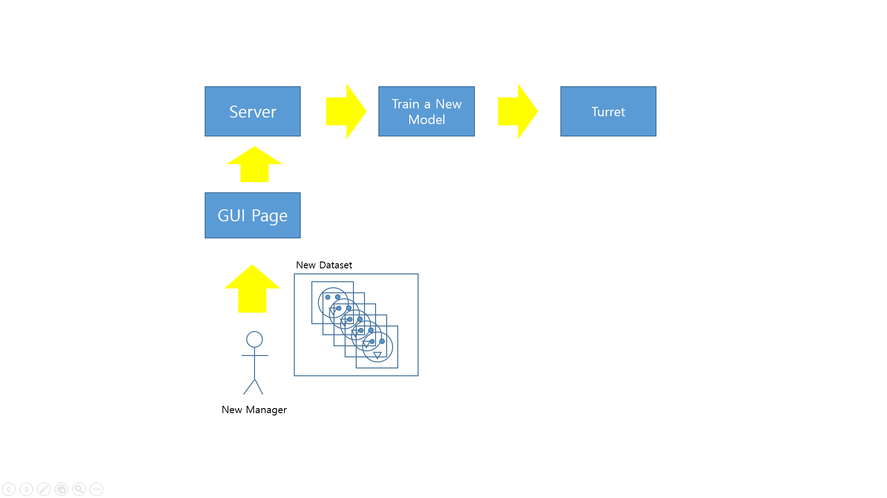
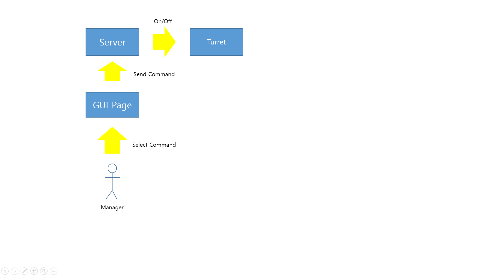
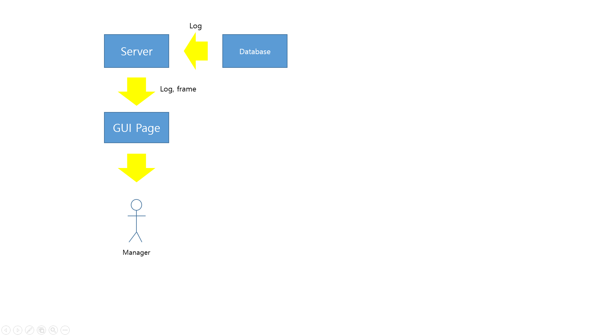

## Case 1 : Main Concept

1. 감시 구역 내 사람이 감지되었을 때 ROI 추출
1. 얼굴 인식 모델 inference
1. 허가된 사용자 통과
1. 비허가된 인원 발포
1. 로그, 프레임 DB로 전송

## Case 2 : Model Update

1. 서버에 접속하여 새로운 데이터셋 업로드
1. 업로드된 데이터셋으로 새로운 모델 훈련
1. 훈련 모델을 터렛으로 업로드

## Case 3 : System On/Off

1. 관리자가 GUI를 통해 서버에 메시지 전송
1. 서버는 전송된 메시지를 터렛에 전송
1. 터렛은 메시지를 받아 해당 명령 처리

## Case 4 : Display Log Data

1. 터렛이 수집한 로그데이터를 DB에 저장
1. 관리자 요청 시 DB에서 정보 확인
