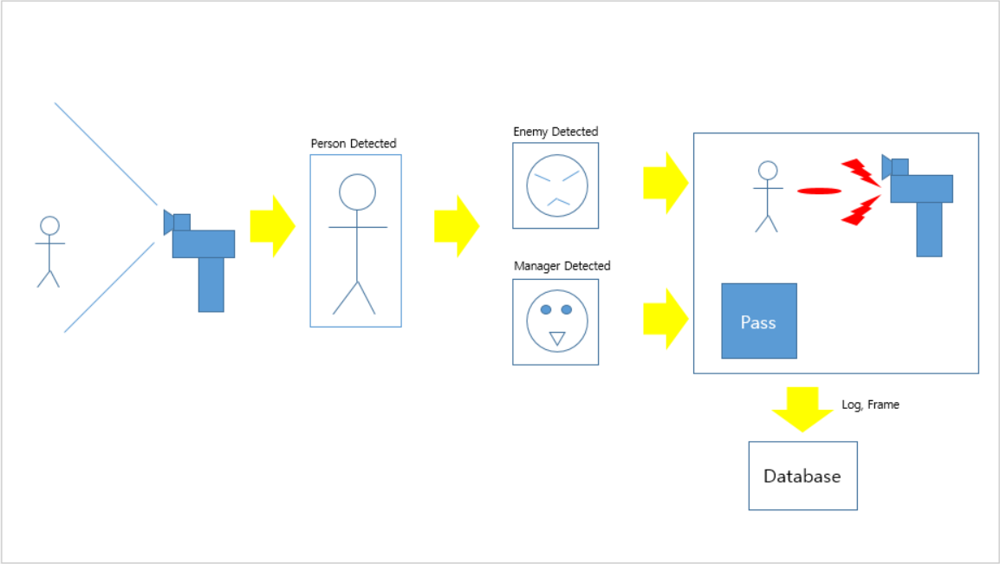

# AI_Turret

KCCI Intel Edge AI

### Team: SystemError

### Members

| Name   | Role                           |
| ------ | ------------------------------ |
| 김동성 | Raspberry Pi Client, H/W build |
| 김지원 | H/W Control, MCU               |
| 김준호 | Linux Server, GUI              |
| 장영주 | AI Model Training              |
| 조윤재 | Linux Server, GUI              |

### Concept Description

1. 인가되지 않은 인원 접근 시 발포
2. 인가된 인원은 통과
