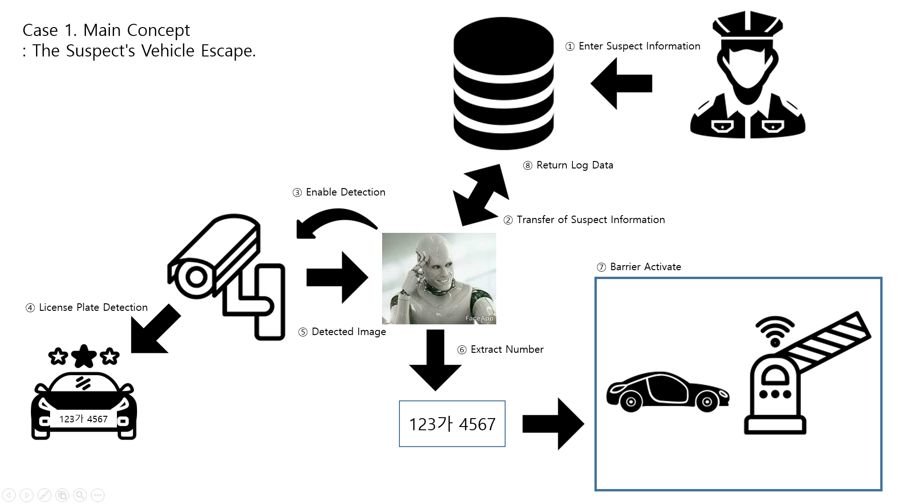
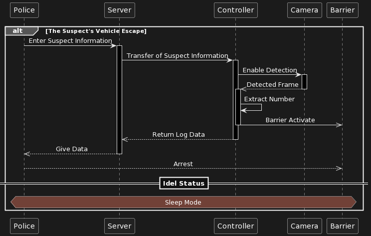

# Team: SystemError

## CaughtYouBastard

### Problem Definition

```
음주운전 등 도주 시 추가 피해 우려가 있는 차량의 운행을 차단하여 피해를 최소화 한다.
```

### Use Case

```
1. 서버를 통해 도주차량의 정보 입력.
2. 컨트롤러가 입력된 정보를 바탕으로 카메라를 이용하여 용의차량의 번호판과 차량번호 식별.
3. 용의차량 접근시 차단장치 작동.
4. 차단 시간,위치,이미지 등 로그 데이터 서버로 전송.
5. 검거
```

### High Level Design



### UML



### Work Breakdown Sheet

| Date  | Settings | AI  | Server | GUI | H/W | Ass'y |
| ----- | -------- | --- | ------ | --- | --- | ----- |
| 08.16 | ○        | ○   | ○      | ○   | ○   |       |
| 08.17 | ○        | ○   | ○      | ○   | ○   |       |
| 08.18 |          | ○   | ○      | ○   | ○   |       |
| 08.19 |          | ○   | ○      | ○   | ○   |       |
| 08.20 |          |     |        |     |     |       |
| 08.21 |          | ○   | ○      |     |     |       |
| 08.22 |          |     |        |     |     | ○     |
| 08.23 |          |     |        |     |     | ○     |

### Members

| Name      | Role        |
| --------- | ----------- |
| 김동성(C) | Client, H/W |
| 김지원    | H/W, MCU    |
| 김준호    | Server, GUI |
| 장영주    | AI          |
| 조윤재    | Server, GUI |

### Repository

https://github.com/goolat/CaughtYouBastard
