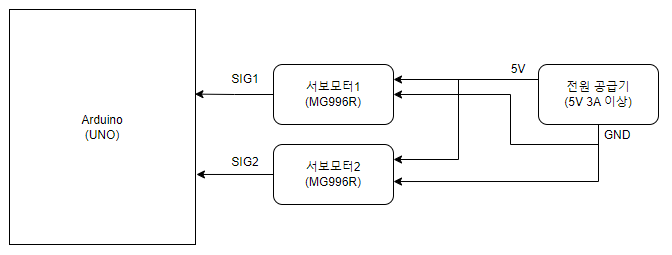

# 서보 모터 제어 시스템

이 프로젝트는 아두이노를 사용하여 시리얼 통신으로 서보 모터를 제어하는 예제입니다.

## 시작하기

이 안내서는 프로젝트를 로컬 컴퓨터에서 실행하는 방법을 안내합니다.

### 사전 요구 사항

- [아두이노 IDE](https://www.arduino.cc/en/software)

### 하드웨어 요구 사항

- 아두이노 보드 (UNO)
- 서보 모터 2개 (MG996R)

### 설치 및 사용법

1. 이 저장소를 로컬 컴퓨터에 복제합니다.
2. 
    
    제공된 배선 다이어그램을 따라 하드웨어 구성을 연결합니다. 
3. 아두이노 IDE를 엽니다.
4. 메인 아두이노 스케치 파일 [Arduino_Servo_Serial.ino](Arduino_Servo_Serial.ino)을 엽니다.
5. 스케치를 아두이노 보드에 업로드합니다.
6. 아두이노 시리얼 모니터를 실행합니다.
7. 'u' 키를 입력하면 서보 모터가 상승하고, 'd' 키를 입력하면 서보 모터가 하강합니다.

## 작동 방식

- 'u' 키를 누르면 하나의 서보 모터가 상승하고 다른 하나는 하강합니다.
- 'd' 키를 누르면 서보 모터의 상태가 반대로 변경됩니다.

## 작성자

- [badrequest](https://github.com/GgobukGgobuk)

## 라이선스

이 프로젝트는 MIT 라이선스 하에 라이선스가 부여됩니다. 자세한 내용은 [LICENSE](../../LICENSE) 파일을 확인하세요.

## 감사의 글

- 온라인 자료와 포럼에서 얻은 아이디어와 서울기술교육센터 교수님들 및 Intel korea 현장 지도 교수님들의 소중한 지도에 깊은 감사 말씀드립니다.