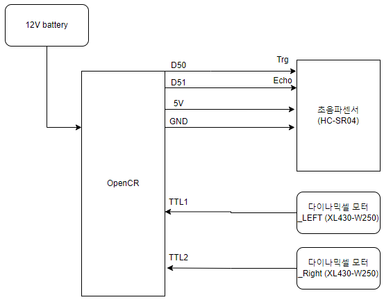

# 로봇 제어

이 프로젝트는 OpenCR, 다이나믹셀 모터 및 초음파 센서를 사용하여 로봇을 제어하는 예제입니다.

## 시작하기

이 안내서는 프로젝트를 로컬 컴퓨터에서 실행하는 방법을 안내합니다.

### 사전 요구 사항

- [아두이노 IDE](https://www.arduino.cc/en/software)
- [다이나믹셀 워크벤치 라이브러리](https://github.com/ROBOTIS-GIT/DynamixelWorkbench)

 
### 하드웨어 요구 사항

- OpenCR 보드
- 다이나믹셀 모터 (XL430-W250)
- 초음파 센서 (HC-SR04)

### 설치 및 사용법

1. 이 저장소를 로컬 컴퓨터에 복제합니다.
2. 아두이노 IDE를 엽니다.
3. 필요한 라이브러리를 설치하세요: 다이나믹셀 워크벤치
4. 
 제공된 배선 다이어그램을 따라 하드웨어 구성을 연결합니다.
5. 메인 아두이노 스케치 파일 [h_Position.ino](h_Position.ino)을 엽니다.

## 작동 방식

1. 스케치를 OpenCR 보드에 업로드합니다.
2. 아두이노 IDE 시리얼 모니터를 실행합니다.
3. 시스템은 초음파 센서에서 데이터를 읽고 다이나믹셀 모터를 제어합니다.
4. 측정된 거리에 따라 로봇이 움직입니다: 거리가 10cm 미만이면 멈추고, 거리가 더 크면 전진합니다.

## 기여하기

기여는 언제든 환영합니다! 풀 리퀘스트를 제출하는 방법과 코드 규칙에 대한 자세한 내용은 [CONTRIBUTING.md](CONTRIBUTING.md) 파일을 확인하세요.

## 작성자

- [badrequest](https://github.com/GgobukGgobuk)

## 라이선스

이 프로젝트는 MIT 라이선스 하에 라이선스가 부여됩니다. 자세한 내용은 [LICENSE](LICENSE) 파일을 확인하세요.

## 감사의 글

- [다이나믹셀 워크벤치 라이브러리](https://github.com/ROBOTIS-GIT/DynamixelWorkbench)
- 온라인 자료와 포럼에서 얻은 아이디어와 서울기술교육센터 교수님들 및 Intel korea 현장 지도 교수님들의 지도에 깊은 감사 말씀드립니다.